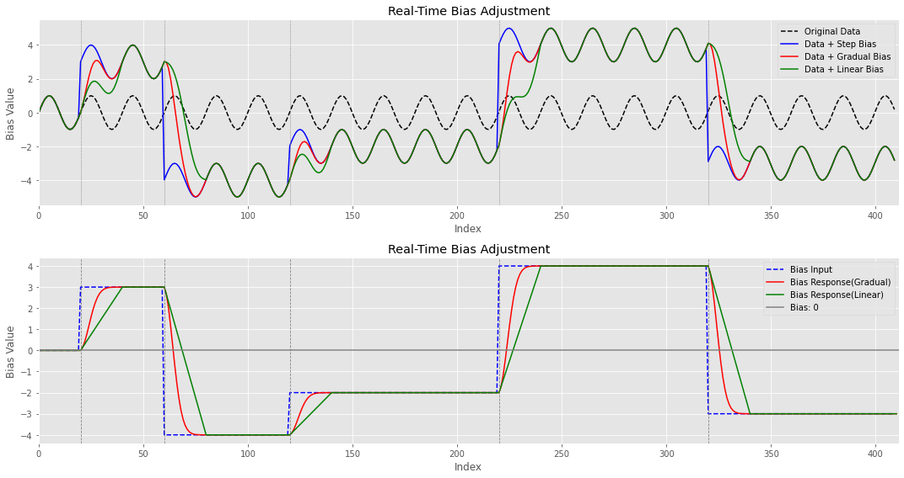

# 실시간 편향(Bias) 조정 가이드

다양한 시스템, 특히 신호 처리, 제어 시스템, 머신 러닝 응용 프로그램에서 정확성과 안정성을 유지하는 것은 매우 중요합니다. 데이터나 시스템 출력의 편향(Bias)은 성능에 심각한 영향을 주며, 잘못된 결과를 초래할 수 있습니다. 따라서 발생하는 문제들을 실시간으로 바로잡는 것이 필수적입니다.

## 편향(Bias) 보정의 중요성
시스템에서 편향(Bias)이 발생하면 결과가 왜곡되고, 잘못된 의사결정이나 시스템 성능 저하를 초래할 수 있습니다. 실시간으로 편향(Bias)을 수정하면 시스템을 효율적이고 정확하게 유지하여 오류 가능성을 줄이고 시스템의 전반적인 신뢰성을 향상시킬 수 있습니다.

## 편향(Bias) 발생 원인 및 해결 방안
편향(Bias)은 센서 오류, 환경 변화, 시스템의 내재적인 부정확성 등 다양한 이유로 발생할 수 있습니다. 이러한 문제를 완화하기 위해 실시간 편향(Bias) 조정 메커니즘을 도입하면 시스템을 지속적으로 보정하고 변화하는 조건에 적응할 수 있습니다.

## 편향(Bias) 보정의 효과
적절한 편향(Bias) 보정을 통해 시스템 성능을 크게 향상시킬 수 있습니다:

- 데이터의 정확한 표현 및 처리를 보장합니다.
- 시스템 출력의 무결성과 신뢰성을 유지합니다.
- 시스템 성능의 장기적인 편차를 방지합니다.

## 편향(Bias) 보정 방법
RealTimeBiasAdjustment 클래스를 사용한 실시간 편향(Bias) 조정은 데이터 입력에 기반하여 편향(Bias) 수준을 동적으로 조절할 수 있는 구조화된 방식을 제공합니다. 이 클래스는 점진적인 변경('gradual')과 선형 변경('linear') 모드를 모두 지원하여 다양한 시스템의 요구 사항과 응답 시간 요구 사항을 충족합니다.

## 사용 예시
파이썬 버전은 3.7.1 이상을 권장합니다.

필수 라이브러리와 버전은 아래와 같습니다.
```
pip install numpy == 1.21.5
pip install matplotlib == 3.5.1
```


```
from RealTimeBiasAdjustment import RealTimeBiasAdjustment

# 편향(Bias) 조정 시스템 초기화
bias_adjuster = RealTimeBiasAdjustment(response_time=20, bias_init=0)

# 새로운 데이터가 도착할 때마다 편향(Bias) 보정 적용
new_index = 10
new_bias_input = 1.5
bias_type = 'gradual'

# 새로운 편향(Bias) 검증 및 적용
adjusted_bias = bias_adjuster.apply_bias(new_index, new_bias_input, bias_type)
```


## 편향(Bias) 모니터링의 중요성
편향(Bias)을 지속적으로 모니터링하는 것은 시간에 따른 변화를 감지하고 적시에 조정할 수 있게 합니다. 
정기적인 모니터링을 통해 다음을 달성할 수 있습니다:

- 잠재적 문제를 그것들이 심각해지기 전에 조기에 감지합니다.
- 시간이 지남에 따른 시스템 성능을 더 잘 이해할 수 있습니다.
- 정확하고 편향(Bias)되지 않은 데이터를 기반으로 정보에 입각한 결정을 내릴 수 있습니다.
- 실시간 편향(Bias) 조정 및 모니터링을 통해 시스템을 더 견고하고 정확하며 신뢰할 수 있게 유지할 수 있습니다.

## 결론
시스템의 정확성과 신뢰성을 유지하기 위해서는 실시간 편향(Bias) 보정이 필수적입니다. 원인을 파악하고 효과적인 보정 및 모니터링 전략을 구현함으로써, 시스템은 최소한의 편향(Bias) 영향으로 최적의 상태로 운영될 수 있습니다